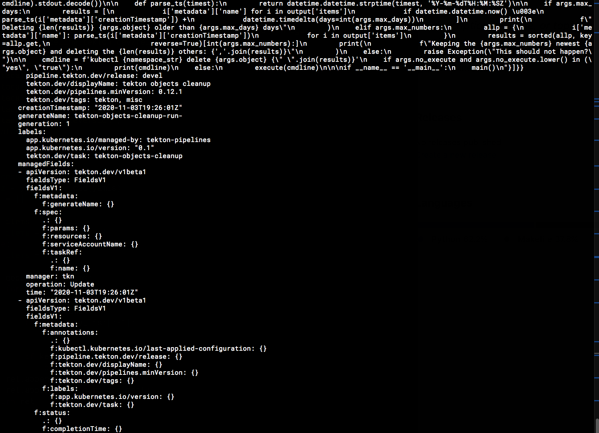
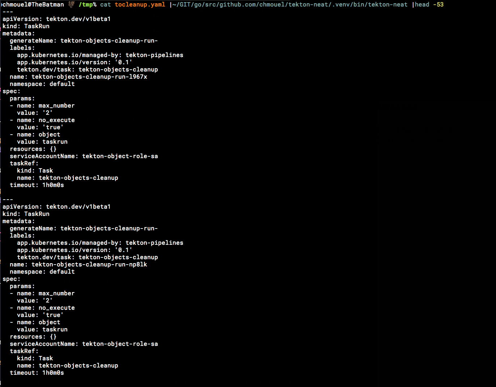

===========
Tekton Neat
===========

.. image:: https://img.shields.io/pypi/v/tekton-neat.svg
        :target: https://pypi.python.org/pypi/tekton-neat

.. image:: https://img.shields.io/codecov/c/github/chmouel/tekton-neat/master.svg?style=flat-square
        :target: https://codecov.io/gh/chmouel/tekton-neat

.. image:: https://img.shields.io/pypi/l/tekton-neat.svg?style=flat-square
        :target: https://pypi.python.org/pypi/tekton-neat

Export your tekton templates neatly

* Free software: MIT license

Features
--------

* Like `kubectl neat <https://github.com/itaysk/kubectl-neat>`_, ``tekton-neat`` cleanup  a  yaml coming from a live object and cleans it so you can easily re-import or inspect it.

Screenshot
----------

It will take some live template like this :

To this :

Install
-------

.. code-block:: bash

   $ pip3 install -U tekton-neat

Usage
-----

You can pipe it :

.. code-block:: bash

   $ kubectl get pipelinerun my-dear-pipeline|tekton-neat|kubectl apply -f-

Or just point to the files directly :

.. code-block:: bash

   $ tekton-neat file1.yaml file2.yaml

AUTHORS
-------

* Chmouel Boudjnah <chmouel@chmouel.com>

Credits
-------

This package was created with Cookiecutter_ and the `audreyr/cookiecutter-pypackage`_ project template.

.. _Cookiecutter: https://github.com/audreyr/cookiecutter
.. _`audreyr/cookiecutter-pypackage`: https://github.com/audreyr/cookiecutter-pypackage
